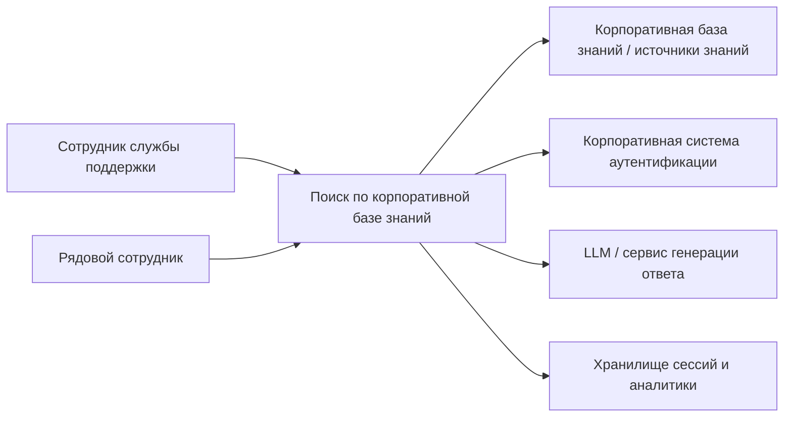
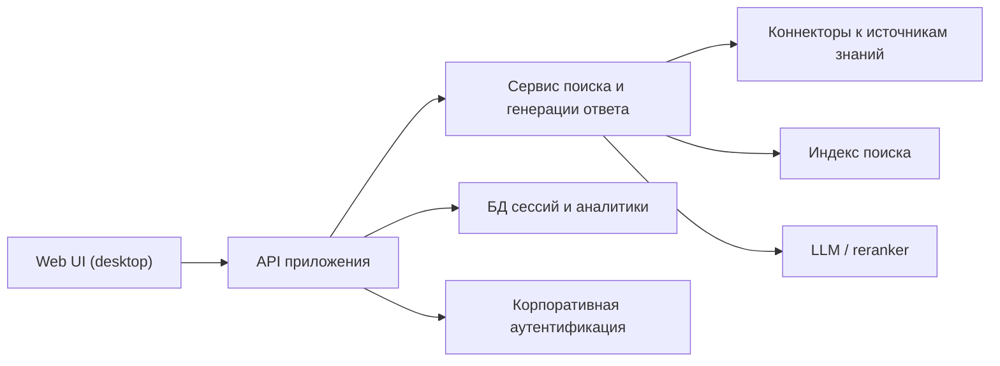

# ARCHITECTURE: Поиск по корпоративной базе знаний

> Заполняется по ходу сессии (навык `architecture`). Держит карту и резюме решений; само решение — в соответствующем ADR (`docs/adr/`). Незаполненное — явный gap: `[NEEDS CLARIFICATION: вопрос | владелец | когда решаем]`.
> Связан с: `docs/VISION.md` (ID фич/доменов).

## Внешние требования (NFR)

| Категория | Требование | Источник |
|-----------|------------|----------|
| Безопасность | Доступ только для внутренних сотрудников после логина | VISION: golden path, non-goals |
| Отказоустойчивость | При недоступности отдельных зависимостей пользователь должен понимать, что ответ временно недоступен | Архитектурная гипотеза, требует подтверждения |
| Производительность | Сокращать время обработки обращения и время ожидания ответа | VISION: измерение, success |
| Персональные данные | LLM и данные поиска остаются в on-premise контуре; в сессии сохраняются `user_id`, исходный запрос, число итераций, конечный ответ и длительность сессии; срок хранения уточняется отдельно | VISION: сохранение сессии в БД, решение по security |

## C4 — Context (L1)

## C4 — Container (L2)

*Если диаграмма не рендерится — структурный список контейнеров с ответственностью каждого.*

## Каноническая модель данных (верхний уровень)

> Только сквозные сущности; пофичевые детали — в `data-model.md` плана фичи.

- **Пользователь** — сотрудник, прошедший аутентификацию; ключевые поля: `user_id`, `role`, `department`.
- **Поисковая сессия** — один цикл поиска ответа; ключевые поля: `session_id`, `user_id`, `started_at`, `ended_at`, `iteration_count`, `resolution_time_ms`, `status`.
- **Сообщение запроса** — изначальная поисковая формулировка или уточнение; ключевые поля: `message_id`, `session_id`, `text`, `created_at`, `feedback_type`.
- **Ответ системы** — конечный сформированный системой ответ; ключевые поля: `answer_id`, `session_id`, `text`, `sources`, `confidence`.
- **Источник знаний** — подключённый источник данных; ключевые поля: `source_id`, `type`, `status`, `refresh_policy`.
- **Документ знаний** — элемент базы знаний, доступный для индексации; ключевые поля: `document_id`, `source_id`, `title`, `content_hash`, `access_scope`.

## Инвентарь внешних зависимостей

| Зависимость | Назначение | Стоимость | Латентность | Что при отказе |
|-------------|------------|-----------|-------------|-----------------|
| Корпоративная система аутентификации | Логин сотрудника | [NEEDS CLARIFICATION: зависит от существующего контура] | Низкая / внутренняя | Логин недоступен, вход блокируется |
| Источники корпоративной базы знаний | Материал для поиска ответа | [NEEDS CLARIFICATION: зависит от числа и типа источников] | Средняя | Ответы деградируют или становятся неполными |
| LLM / сервис генерации ответа | Формулирует ответ человеческим языком | [NEEDS CLARIFICATION: зависит от выбранной модели и контура] | Средняя или высокая | Показывать найденные топики без генерации либо ошибку |
| PostgreSQL + pgvector | Хранение сессий, аналитики и векторного индекса | В рамках стандартной БД-инфраструктуры | Низкая или средняя | Поиск и сохранение сессий недоступны |

## Решения по контейнерам (контур 1)

| Контейнер | Решение (технология) | ADR | Обслуживает (ID из VISION) |
|-----------|----------------------|-----|-----------------------------|
| Web UI (desktop) | ASP.NET Core MVC / Razor Pages | ADR-003 | D1-F1 |
| API приложения | ASP.NET Core в составе модульного монолита | ADR-002 | D1-F1, D1-F2 |
| Сервис поиска и генерации ответа | В составе модульного монолита на .NET как внутренний модуль | ADR-001, ADR-002 | D1-F1, D1-F2 |
| Индекс поиска | PostgreSQL + pgvector | ADR-004 | D1-F1, D1-F2 |
| БД сессий и аналитики | PostgreSQL | ADR-004 | D1-F1 |
| Коннекторы к источникам знаний | В составе модульного монолита как расширяемый модуль адаптеров | ADR-001 | D1-F2 |

## Обязательные темы (контур 2)

| Тема | Решение / статус | ADR |
|------|-------------------|-----|
| Security-by-design (вкл. ПДн и резидентность) | Принято: on-premise LLM и обработка данных внутри периметра | ADR-005 |
| Телеметрия (logs / metrics / traceability) | Принято: минимальный контур наблюдаемости для запуска первой версии | ADR-006 |
| Тестирование (уровни + философия) | Принято: Experiment-first для AI/RAG-контура, автоматические тесты для deterministic-контуров | ADR-007 |

## Предлагаемая поправка в constitution

> Не применено автоматически; это только предложенный текст для отдельного governance-решения.

`Для AI/RAG-функциональности проект использует philosophy Experiment-first: сначала стабилизируем поведение на прототипах, ручных сценариях и интеграционных проверках, затем фиксируем подтверждённое поведение автоматическими регресс-тестами. Для deterministic-контуров (аутентификация, API-контракты, сохранение сессий, адаптеры источников, права доступа) обязательны автоматические тесты на уровне unit/integration до или вместе с реализацией.`

## Открытые вопросы (gaps)

- `[NEEDS CLARIFICATION: определить срок хранения сессий и правила удаления | заказчик и ИБ | до проектирования persistence-политики]`
- `[NEEDS CLARIFICATION: определить корпоративную систему аутентификации и протокол интеграции | заказчик и инфраструктура | до проектирования auth-модуля]`
- `[NEEDS CLARIFICATION: выбрать on-premise LLM и зрелый .NET-способ интеграции с ним | архитектурный владелец | до технического плана реализации D1-F1]`
- `[NEEDS CLARIFICATION: определить первую очередь источников знаний и формат их подключения | заказчик | до проектирования connector-модуля D1-F2]`
